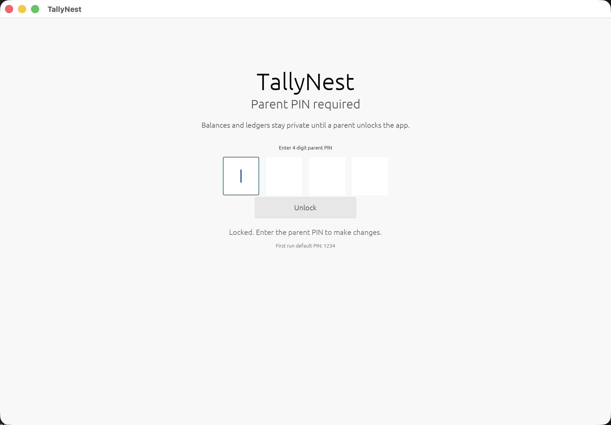
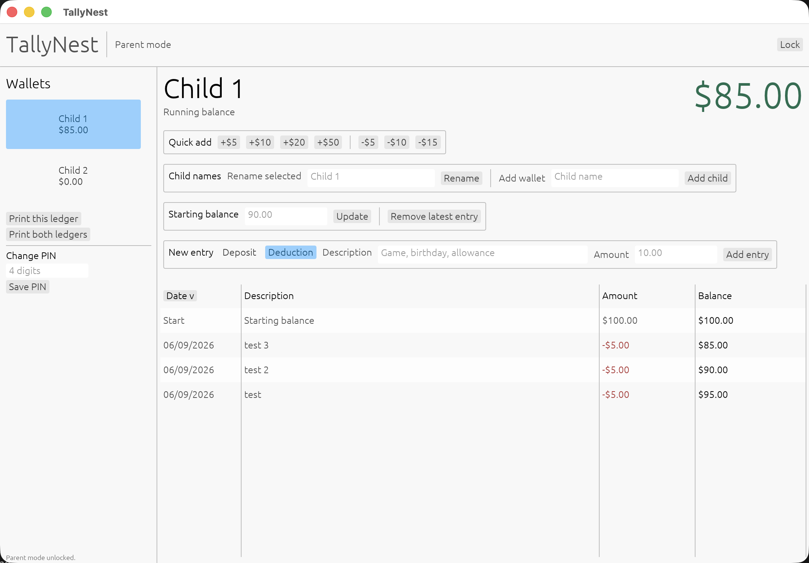

# Atlas Wallet

Atlas Wallet is a small Windows-friendly Rust desktop app for tracking money held for kids.





It starts with two neutral child wallets. Each wallet keeps a local ledger of deposits and deductions, similar to a handwritten allowance sheet:

- Starting balance
- Money added
- Money spent
- Description for each entry
- Date
- Automatic running balance
- Parent PIN unlock
- Printable ledgers
- Custom child wallet names

## Download

For a local build, the Windows executable is:

```text
target\release\AtlasWallet.exe
```

For a portable release zip:

```powershell
.\scripts\package-windows.ps1 -Version 0.1.0
```

The zip will be created in `dist/`.

## Parent PIN

Atlas Wallet opens to a parent PIN screen so kids cannot add or remove entries without a parent unlocking the app first.

The first-run PIN is:

```text
1234
```

After unlocking, use **Change PIN** in the left sidebar to choose a different 4 digit PIN.

This is a simple family-use lock, not high-security encryption.

## Child Wallets

Atlas Wallet starts with `Child 1` and `Child 2` so the public app does not include anyone's real names.

After unlocking parent mode, use **Child names** to rename the selected wallet or add another child wallet.

## Printing

Use **Print this ledger** to print the selected child's ledger, or **Print both ledgers** to print both child wallets together.

Atlas Wallet creates a local printable HTML file and opens it in your browser with the print dialog ready.

## Windows Installer

The repository includes an Inno Setup script at `installer/AtlasWallet.iss`.

Build the release executable first:

```powershell
cargo build --release
```

Then open `installer/AtlasWallet.iss` in Inno Setup and compile the installer. The installer output is written to `dist/`.

## Development

Install Rust from [rustup.rs](https://rustup.rs), then run:

```powershell
cargo run
```

To create a release build:

```powershell
cargo build --release
```

The app stores data locally in your operating system's app data folder as JSON.
Existing TallyNest and AirWallet data is imported automatically on the first launch.

If `cargo` is not on PATH on Windows, add Rust's Cargo folder to PATH:

```powershell
$env:Path += ";$env:USERPROFILE\.cargo\bin"
cargo run
```

## Release Checklist

See [docs/RELEASE.md](docs/RELEASE.md).

## Project Goals

- Simple enough for a family to use without setup
- Local-first, no accounts or cloud service required
- Easy to open source and maintain
- Friendly interface for parents and kids

## Contributing

This is a maintainer-led family app. Contributions are welcome when they fit the project goals, but all changes must go through issues or pull requests and maintainer review.

See [CONTRIBUTING.md](CONTRIBUTING.md) before opening a pull request.

Repository protection recommendations are documented in [docs/GITHUB_SETTINGS.md](docs/GITHUB_SETTINGS.md).

## License

MIT
