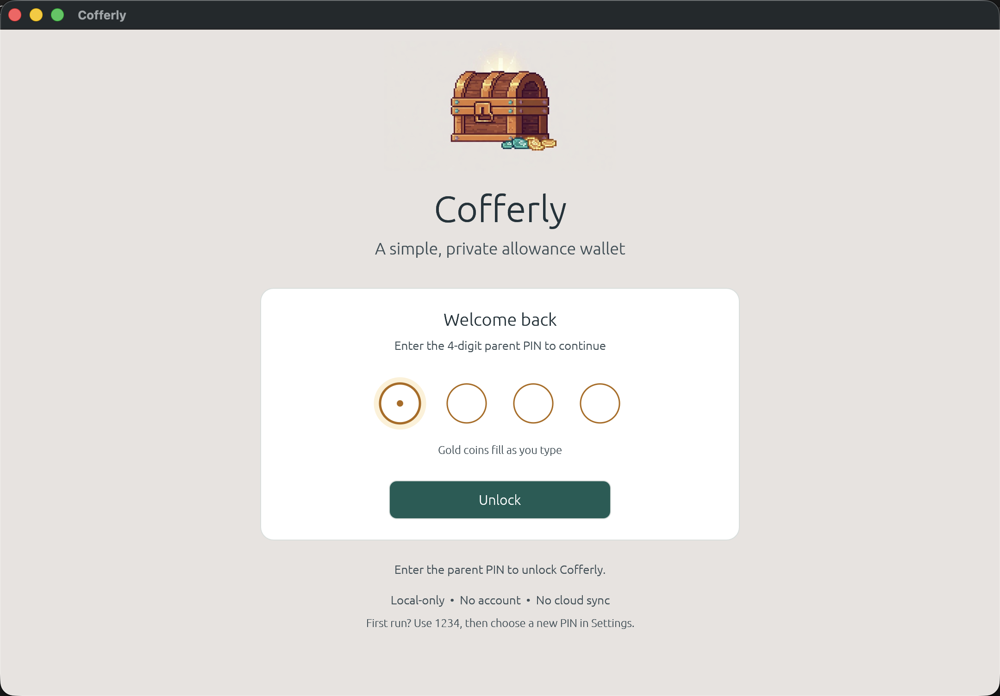
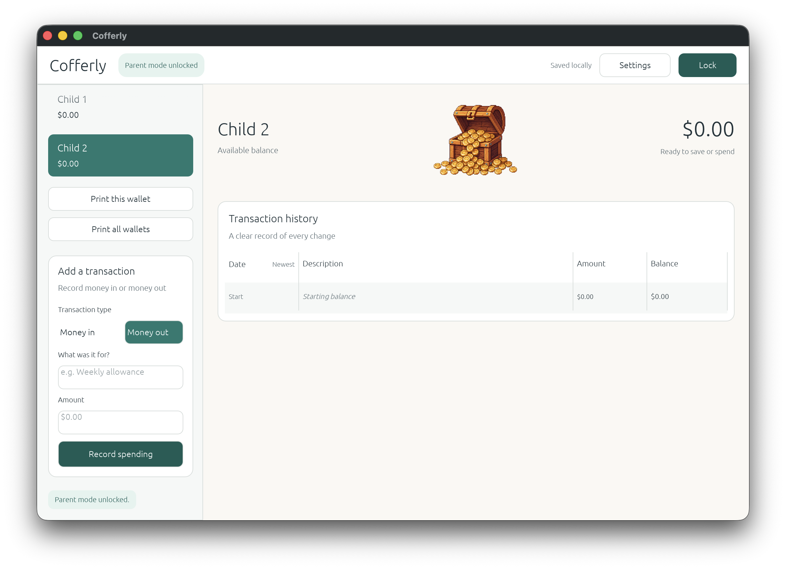
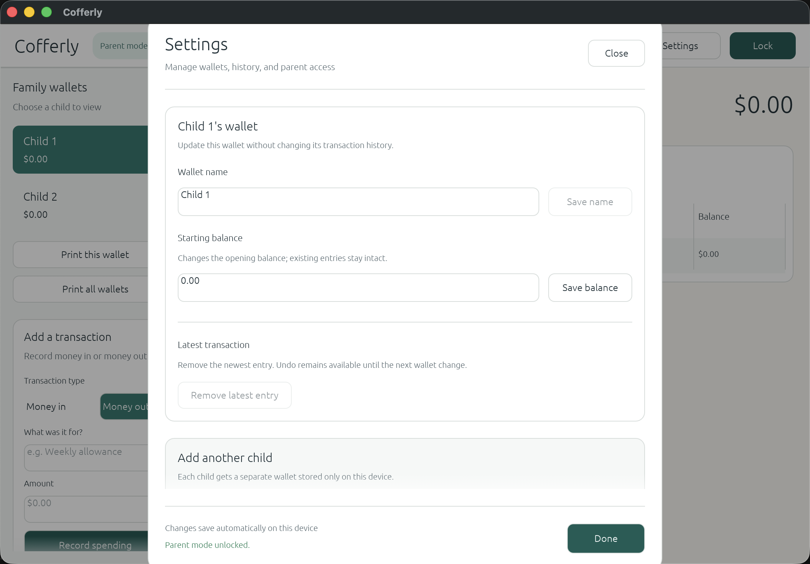

# Cofferly

Cofferly is a small Windows-friendly Rust desktop app for tracking money held for kids.

Parent PIN screen:



Unlocked wallet ledger:



Parent settings:



Cofferly starts with two neutral child wallets. Each wallet keeps a local ledger of deposits and deductions, similar to a handwritten allowance sheet:

- Starting balance
- Money added
- Money spent
- Description for each entry
- Date
- Automatic running balance
- Parent PIN unlock
- Printable ledgers
- Custom child wallet names
- Local encrypted data file

## Download

For a local build, the Windows executable is:

```text
target\release\Cofferly.exe
```

For a portable release zip:

```powershell
.\scripts\package-windows.ps1 -Version 0.1.0
```

The zip will be created in `dist/`.

## Parent PIN

Cofferly opens to a parent PIN screen so kids cannot add, remove, rename, or print entries without a parent unlocking the app first.

The first-run PIN is:

```text
1234
```

After unlocking, open **Settings** to choose a different 4-digit PIN.

The PIN is used both to unlock the interface and to derive the key for encrypting the data file on disk. It is a simple family-use protection (4 digits), not high-security encryption.

## Child Wallets

Cofferly starts with `Child 1` and `Child 2` so the public app does not include anyone's real names.

After unlocking parent mode, open **Settings** to rename the selected wallet, update its starting balance, add another child wallet, or delete a wallet. Wallet deletion uses a confirm/cancel step and keeps at least one wallet available.

Use **Remove latest entry** in Settings to undo the most recent ledger entry for the selected wallet. The app offers a short undo window before the next change.

## Printing

Use **Print this ledger** to print the selected child's ledger, or **Print both ledgers** to print both child wallets together.

Cofferly writes a temporary printable HTML file (in your OS temp folder) and opens it in your browser. Previous print files are cleaned up when the app starts.

## Windows Installer

The repository includes an Inno Setup script at `installer/Cofferly.iss`.

Build the release executable first:

```powershell
cargo build --release
```

Then open `installer/Cofferly.iss` in Inno Setup and compile the installer. The installer output is written to `dist/`.

## Development

Install Rust from [rustup.rs](https://rustup.rs), then run:

```powershell
cargo run
```

To create a release build:

```powershell
cargo build --release
```

The app stores data locally in your operating system's app data folder.

Data files are encrypted at rest using the parent PIN (Argon2id key derivation + XChaCha20-Poly1305 authenticated encryption). This protects against casual tampering with the ledger file.

Old plain JSON files (including imports from Atlas Wallet / TallyNest / AirWallet) are automatically migrated to the encrypted format. Legacy files are encrypted on import and the plaintext copies are removed after a verified write. A plain file already at the Cofferly path is re-encrypted on the first successful unlock.

The encryption key is derived once per unlock (envelope encryption); subsequent saves reuse a session data key so the UI does not stall on Argon2id for every transaction. Parent mode also locks automatically after a period of inactivity.

Derived keys and plaintext serialization/decryption buffers are zeroized when dropped. The app's goal is family-use privacy and tamper resistance, not protection against a determined attacker who has the data file and can brute-force all 10,000 PINs offline.

If `cargo` is not on PATH on Windows, add Rust's Cargo folder to PATH:

```powershell
$env:Path += ";$env:USERPROFILE\.cargo\bin"
cargo run
```

## Release Checklist

See [docs/RELEASE.md](docs/RELEASE.md).

## Project Goals

- Simple enough for a family to use without setup
- Local-first, no accounts or cloud service required
- Easy to open source and maintain
- Friendly interface for parents and kids

## Contributing

This is a maintainer-led family app. Contributions are welcome when they fit the project goals, but all changes must go through issues or pull requests and maintainer review.

See [CONTRIBUTING.md](CONTRIBUTING.md) before opening a pull request.

Repository protection recommendations are documented in [docs/GITHUB_SETTINGS.md](docs/GITHUB_SETTINGS.md).

## License

MIT
