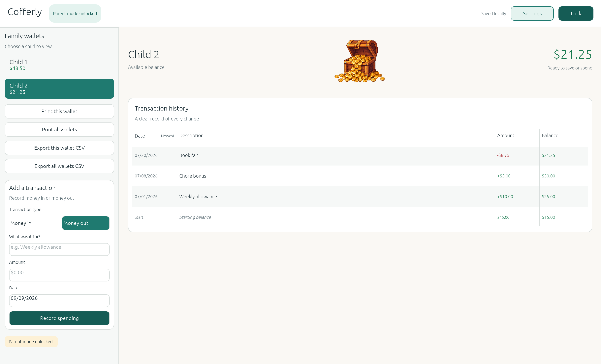
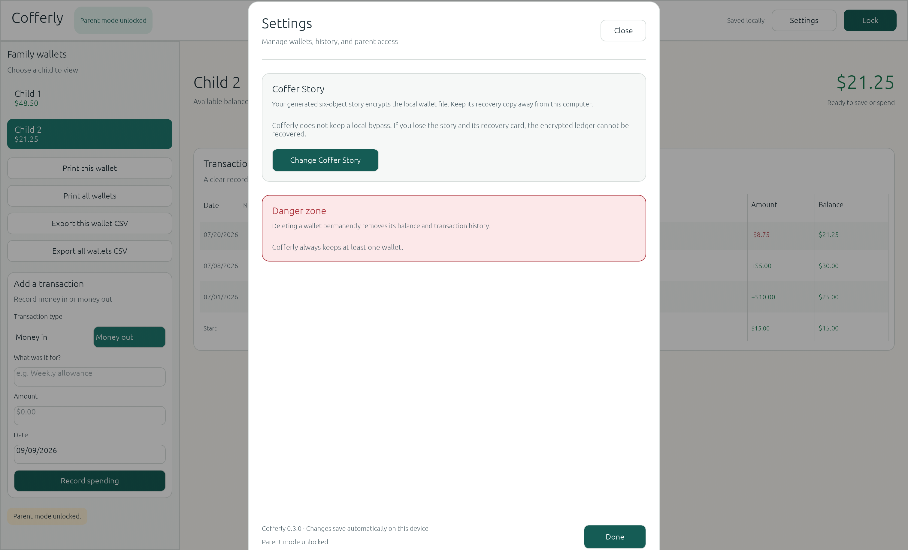

# Cofferly

Cofferly is a small Windows-friendly Rust desktop app for tracking money held for kids.

Parent Coffer Story unlock:


Unlocked wallet ledger:



Parent settings:



Cofferly starts with two neutral child wallets. Each wallet keeps a local ledger of deposits and deductions, similar to a handwritten allowance sheet:

- Starting balance
- Money added
- Money spent
- Description for each entry
- Date
- Automatic running balance
- Coffer Story parent unlock
- Printable ledgers
- Custom child wallet names
- Local encrypted data file

## Download

**Latest release (recommended):** [Cofferly releases on GitHub](https://github.com/danielendara/cofferly/releases/latest)

| Asset | What it is |
|-------|------------|
| `Cofferly-*-windows-x64.zip` | Portable app — unzip and run `Cofferly.exe` |
| `Cofferly-*-Setup.exe` | Windows installer (when published with the release) |

No account, no cloud — data stays on your PC as an encrypted `vault.cofferly` file.

### Build from source

```powershell
cargo build --release
# → target\release\Cofferly.exe

.\scripts\package-windows.ps1 -Version 0.3.0
# → dist\Cofferly-0.3.0-windows-x64.zip
```

## Coffer Story

Cofferly opens to a Coffer Story screen so kids cannot add, remove, rename, or print entries without a parent unlocking the app first.

Cofferly generates a sequence of six distinct objects from a stable set of 30. **Write the sequence down** (or use a [recovery card](docs/recovery-card.md)) and store it **away from the computer**, then confirm it by choosing the objects in order from the shuffled grid. Cofferly deliberately generates the story rather than allowing a human-chosen sequence.

> **There is no local bypass.** If both the story and your recovery copy are lost, the encrypted ledger **cannot be recovered**. Treat the story like a house key you cannot re-cut.

The story is also the input used to encrypt the local data file. Six ordered, distinct objects from 30 provide 427,518,000 possible sequences (about 28.7 bits). This is a substantial improvement over a four-digit PIN, but it does not protect against someone watching the objects as they are entered.

### Upgrading from a parent PIN

Existing installations with a four-digit PIN show a clearly labeled **Legacy PIN** screen. After a successful PIN unlock, Cofferly enrolls a new Coffer Story (generate → write it down → confirm). The old PIN no longer works once migration finishes.


## Child Wallets

Cofferly starts with `Child 1` and `Child 2` so the public app does not include anyone's real names.

After unlocking parent mode, open **Settings** to rename the selected wallet, update its starting balance, add another child wallet, or delete a wallet. Wallet deletion uses a confirm/cancel step and keeps at least one wallet available.

Use **Remove latest entry** in Settings to undo the most recent ledger entry for the selected wallet. The app offers a short undo window before the next change.

### Weekly allowance

In **Settings**, each wallet has an optional **Weekly allowance** amount. Leave it blank to keep it off. Saving an amount turns it on, and the day you save it becomes the posting weekday (shown in Settings). That first day doesn't post; the first entry is added one week later.

Each time parent mode is unlocked, Cofferly adds one "Weekly allowance" deposit for every posting weekday you missed, dated on those weekdays, and says how many it added in the status line. It never adds future dates, and it catches up at most 8 weeks; if more were missed, the status line says how many older weeks were skipped. The entries and the date of the last one posted are saved together in the encrypted vault, so unlocking again, relaunching, or restoring a backup never adds the same week twice. If saving fails, nothing is added and the next unlock tries again.

Changing the amount only affects future weeks. Turning it off and back on starts fresh from the new day; the weeks it was off are not posted. Allowance entries can be edited or removed like any other entry. Cofferly doesn't post while it's locked or closed.

## Printing and CSV export

Use **Print this wallet** to print the selected child's ledger, or **Print all wallets** to print every child wallet together.

Use **Export this wallet CSV** or **Export all wallets CSV** for a spreadsheet backup. Amounts are plain decimals (no `$`) so Excel, Numbers, and LibreOffice can sum them.

Cofferly writes these files in your OS temp folder and opens them. Previous Cofferly HTML and CSV temp files are cleaned up when the app starts. Nothing is uploaded.

## Back up and move to a new PC

All wallets live in one encrypted `vault.cofferly` file, so a lost or reimaged disk loses them even if you still have your Coffer Story. Keep a backup somewhere else, like a USB stick or another drive.

- **Back up:** in parent mode, open **Settings → Backup → Back up vault…** and pick a folder. Cofferly saves a byte-for-byte encrypted copy named `Cofferly-backup-YYYY-MM-DD.cofferly`, reads it back to verify it, and shows **Last backup** in Settings. It never replaces an existing file without asking.
- **Restore or move:** on the new PC, choose **Restore from backup…**. It's on the first-run screen, or in **Settings → Backup** once parent mode is unlocked. Pick the `.cofferly` file and enter the Coffer Story that was in use when the backup was made. Cofferly shows the wallets in the backup and asks you to confirm before replacing anything. The vault that was on this PC is kept next to it as `vault.pre-restore-<timestamp>.cofferly`.

A backup is as private as the vault: without its Coffer Story it can't be opened. If you later change your Coffer Story, make a fresh backup.

## Windows Installer

The repository includes an Inno Setup script at `installer/Cofferly.iss`.

Build the release executable first:

```powershell
cargo build --release
```

Then open `installer/Cofferly.iss` in Inno Setup and compile the installer. The installer output is written to `dist/`.

## Development

Install Rust from [rustup.rs](https://rustup.rs).

**Windows**

```powershell
cargo run
cargo build --release
```

**macOS / Linux**

```bash
cargo run
cargo build --release
```

On Debian/Ubuntu, install GUI packages before the first build:

```bash
sudo apt-get install -y libxcb-render0-dev libxcb-shape0-dev libxcb-xfixes0-dev libxkbcommon-dev libssl-dev libgtk-3-dev
```

The binary is `target/release/Cofferly` (or `Cofferly.exe` on Windows). There is no macOS/Linux installer yet; run the release binary from that path.

The app stores data locally as `vault.cofferly` in your operating system's Cofferly app data folder.

Data files are encrypted at rest using the Coffer Story (Argon2id key derivation + XChaCha20-Poly1305 authenticated encryption). This protects against casual tampering with the ledger file.

Cofferly reads only its current encrypted data format. The custom filename accurately identifies an encrypted Cofferly vault; security does not depend on hiding the filename or format.

### Upgrading from `data.json`

On the first launch after this filename change, Cofferly safely transitions an existing encrypted `data.json`:

1. If `vault.cofferly` already exists, Cofferly uses it and does not modify either file.
2. Otherwise, Cofferly validates that `data.json` has the current encrypted format.
3. It atomically creates `vault.cofferly` and verifies that every byte matches the source.
4. It keeps `data.json` untouched as a recovery backup.

After unlocking, verify every wallet and recent entry, close and reopen Cofferly, and verify the vault again. Only then should you archive or manually delete `data.json`. If verification fails, close Cofferly, move `vault.cofferly` aside, and keep the original `data.json` for recovery.

Plaintext and unsupported files are never converted or overwritten automatically.

The encryption key is derived once per unlock (envelope encryption); subsequent saves reuse a session data key so the UI does not stall on Argon2id for every transaction. Parent mode also locks automatically after a period of inactivity.

Derived keys and plaintext serialization/decryption buffers are zeroized when dropped. The app's goal is family-use privacy and tamper resistance, not absolute protection against a determined attacker who has the data file.

If `cargo` is not on PATH on Windows, add Rust's Cargo folder to PATH:

```powershell
$env:Path += ";$env:USERPROFILE\.cargo\bin"
cargo run
```

## Release Checklist

See [docs/RELEASE.md](docs/RELEASE.md).

## Project Goals

- Simple enough for a family to use without setup
- Local-first, no accounts or cloud service required
- Easy to open source and maintain
- Friendly interface for parents and kids

## Contributing

This is a maintainer-led family app. Contributions are welcome when they fit the project goals, but all changes must go through issues or pull requests and maintainer review.

See [CONTRIBUTING.md](CONTRIBUTING.md) before opening a pull request.

Repository protection recommendations are documented in [docs/GITHUB_SETTINGS.md](docs/GITHUB_SETTINGS.md).

## Third-party assets

Story icons in `assets/story-icons/` are [Twemoji](https://github.com/twitter/twemoji) (CC-BY 4.0). See [assets/story-icons/LICENSE.txt](assets/story-icons/LICENSE.txt).

## License

MIT
